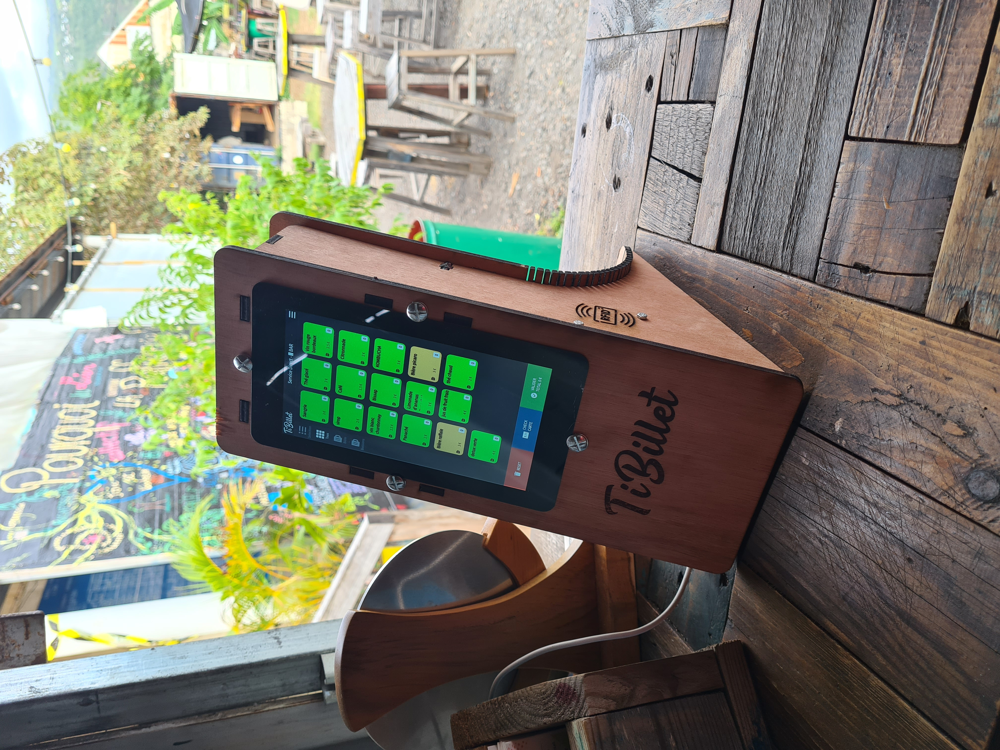
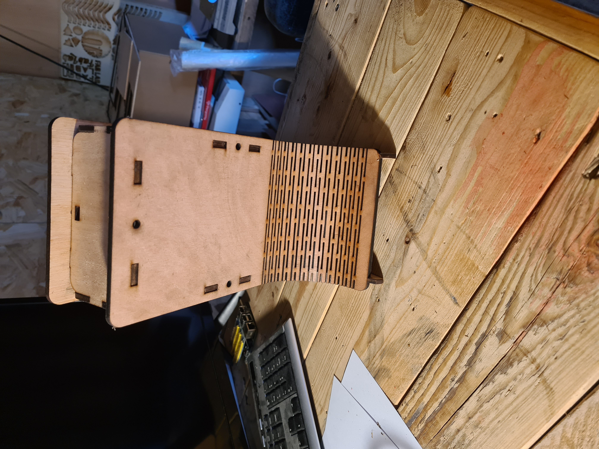

# DIY-point-of-sale-hardware
# ---Under construction---

## Materiel necessaire :
- planches de contre plaqué 5 mm
- Boulon poelier diametre 5mm longeur 16mm
- Decoupeur lazer
- Raspberry Pi3,Alimentation,carteSD
- Cable HDMI
- Cable USB/MicroUSB
- Vis pour contre plaqué de 5 mm 
